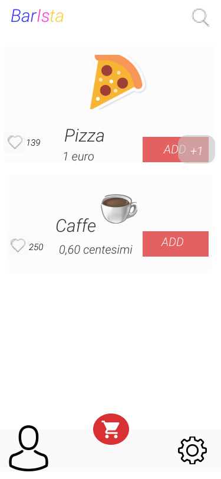

#Bar-Ista
#Monastirli-Olteanu-Caucci
This is an app to order various types of food and drinks at the school bar.
After a login, made of username and password, we are directed to the home.
In the home we have a menu where it's possible to order or add items to a cart.
It's present a function that allows to like a particular item.
On the top right corner there is a magnifying glass that allows to search items.
At the bottom of the page there are 3 buttons: 
-the button on the left directs to the user page;
-the central one directs to the cart;
-the button on the right directs to the settings page.

